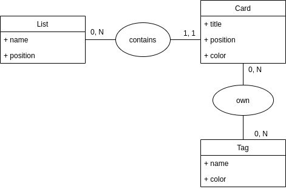

# Analyse de la demande client

## Détection des entités

Qu'est-ce qu'on manipule ?

- Cartes
- Listes
- Tags

## Mise en situation (exemple)

J'ai :
- une liste "à faire", qui contient: 
    - une carte "faire les courses", avec le tag "urgent"
    - une carte "acheter le prochain assassin's creed", avec le tag "perso"
- une liste "terminé":
    - une carte "faire à manger", avec le tag "perso"
    - une carte "faire le MCD", avec les tags "urgent" et "dev"

Prenons un exemple de création :
> je crée une carte "appeler ma maman", qui doit être rouge. Puis je veux la modifier pour qu'elle soit bleu clair.

Si on utilise l'entité Color :
1. je dois crée la couleur "rouge" avec la bonne valeur hexa
2. je crée la carte
3. j'associe la carte X à la couleur "rouge"
4. je dois ensuite crée la couleur "bleu clair" avec la bonne valeur
5. modifier la carte pour lui associer la nouvelle couleur

Si on utilise plutôt un simple champ "color" dans les entités :
1. je crée ma carte, en choisissant son titre ET sa couleur (avec un < `<input type="color">`)
2. je modifie ma carte, je change de couleur dans l'input "couleur".

=> on ne crée pas d'entité Color, on utilise plutôt un champ "color" dans toutes les entités qui pourront être colorées.

## On dessine le MCD

